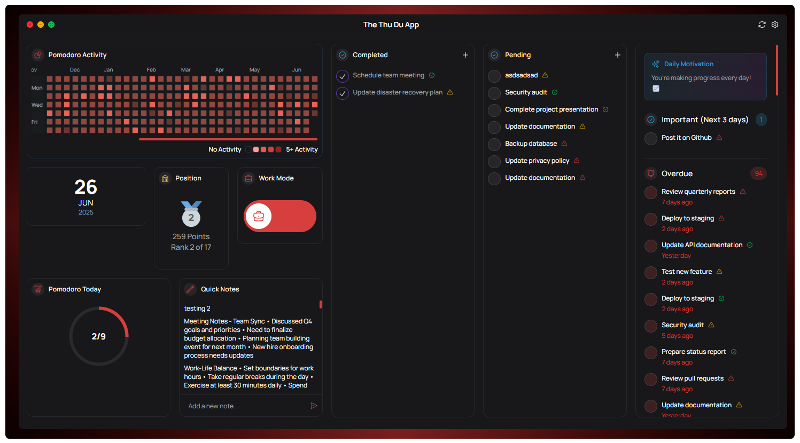

# Not Your Regular Todo App 🚀

A beautiful, feature-rich productivity app built with React, TypeScript, and Electron. More than just a todo list - it's your complete productivity companion with notes, calendar integration, activity tracking, and a delightful user experience.



## ✨ Features

### 📝 Smart Todo Management

- **Intuitive Interface**: Clean, modern design with smooth animations
- **Priority Levels**: High, medium, and low priority tasks
- **Status Tracking**: Pending, in-progress, and completed states
- **Date Organization**: Calendar-based todo management
- **Quick Actions**: Easy create, edit, and delete operations

### 📔 Quick Notes

- **Bullet Point Support**: Automatic bullet points on Enter key
- **Auto-Save**: Saves every 2 minutes when changes are detected
- **Persistent Storage**: All notes are saved locally
- **Clean Interface**: Distraction-free note-taking experience

### 📅 Calendar Integration

- **Visual Calendar**: See your todos organized by date
- **Date Navigation**: Easy browsing through months
- **Todo Overview**: Quick view of daily tasks
- **Activity Tracking**: Visual representation of your productivity

### 📊 Activity Analytics

- **Activity Graph**: Visual tracking of completed tasks
- **Streak Badges**: Bronze, Silver, and Gold achievement system
- **Progress Insights**: Understand your productivity patterns
- **Motivational Messages**: Encouraging feedback and tips

### 🎯 User Onboarding

- **Multi-Step Setup**: Welcome, profile, timezone, and theme selection
- **Personalization**: Customize your experience from day one
- **Guided Experience**: Smooth introduction to all features
- **Theme Support**: Light and dark mode preferences

### 🎨 Beautiful UI/UX

- **Modern Design**: Clean, minimalist interface
- **Smooth Animations**: Delightful micro-interactions
- **Responsive Layout**: Works perfectly on different screen sizes
- **Accessibility**: Designed with accessibility in mind

### 🔧 Technical Features

- **Cross-Platform**: Windows, macOS, and Linux support
- **Offline-First**: Works without internet connection
- **Local Storage**: All data stored securely on your device
- **Performance**: Fast and responsive application

## 🛠️ Tech Stack

- **Frontend**: React 18, TypeScript, Tailwind CSS
- **Desktop**: Electron
- **Database**: SQLite (better-sqlite3)
- **Animations**: Framer Motion
- **Date Handling**: Moment.js
- **Icons**: Heroicons
- **Build Tool**: Vite

## 🚀 Getting Started

### Prerequisites

- Node.js (v16 or higher)
- npm or yarn

### Installation

1. **Clone the repository**

   ```bash
   git clone https://github.com/yourusername/not-your-regular-todo-app.git
   cd not-your-regular-todo-app
   ```

2. **Install dependencies**

   ```bash
   npm install
   # or
   yarn install
   ```

3. **Start the development server**

   ```bash
   npm run dev
   # or
   yarn dev
   ```

4. **Build for production**
   ```bash
   npm run build
   # or
   yarn build
   ```

## 📊 Generate Sample Data

Want to see the app in action with realistic data? Generate 5 months of sample todos and notes:

```bash
# First, start the app once to create the database
npm run dev

# Then generate sample data
npm run generate-data
```

This will create:

- 150 realistic todos with varied priorities and statuses
- 50 diverse notes (meeting notes, project ideas, personal reflections)
- 1 default user profile
- Data spread across the last 5 months

## 🎯 Usage Guide

### Creating Todos

1. Click the "+" button or use the "Create New Todo" modal
2. Enter a title and optional description
3. Set priority level (high, medium, low)
4. Choose a date
5. Save and start tracking!

### Managing Notes

1. Navigate to the Quick Notes section
2. Start typing - each new line becomes a bullet point
3. Notes auto-save every 2 minutes
4. All your thoughts are safely stored

### Calendar Navigation

1. Use the calendar to browse different dates
2. Click on any date to see todos for that day
3. Visual indicators show days with active todos
4. Track your productivity over time

### Activity Tracking

1. View your activity graph to see completion patterns
2. Earn streak badges for consistent productivity
3. Get motivational messages and tips
4. Understand your work habits better

## 🏗️ Project Structure

```
not-your-regular-todo-app/
├── electron/                 # Electron main process
│   ├── database.ts          # Database operations
│   ├── main.ts              # Main process entry
│   └── preload.ts           # Preload scripts
├── src/                     # React application
│   ├── components/          # React components
│   │   ├── UI/             # Reusable UI components
│   │   └── ...             # Feature components
│   ├── assets/             # Static assets and SVGs
│   ├── hooks/              # Custom React hooks
│   ├── types/              # TypeScript type definitions
│   └── utils/              # Utility functions
├── scripts/                # Utility scripts
│   └── generate-dummy-data.js  # Sample data generator
└── public/                 # Public assets
```

## 🔧 Development

### Available Scripts

- `npm run dev` - Start development server
- `npm run build` - Build for production
- `npm run lint` - Run ESLint
- `npm run preview` - Preview production build
- `npm run generate-data` - Generate sample data

### Database Schema

The app uses SQLite with three main tables:

- **users**: User profiles and preferences
- **todos**: Todo items with titles, descriptions, priorities, and dates
- **notes**: Quick notes with content and timestamps

### Contributing

1. Fork the repository
2. Create a feature branch (`git checkout -b feature/amazing-feature`)
3. Commit your changes (`git commit -m 'Add amazing feature'`)
4. Push to the branch (`git push origin feature/amazing-feature`)
5. Open a Pull Request

## 🎨 Customization

### Themes

The app supports light and dark themes, which can be selected during onboarding or in settings.

### Styling

Built with Tailwind CSS for easy customization. Modify the design system in the Tailwind configuration.

## 📱 Platform Support

- ✅ Windows 10/11
- ✅ macOS 10.15+
- ✅ Linux (Ubuntu 18.04+, Fedora 30+)

## 🤝 Contributing

We welcome contributions! Please see our [Contributing Guide](CONTRIBUTING.md) for details.

## 📄 License

This project is licensed under the MIT License - see the [LICENSE](LICENSE) file for details.

## 🙏 Acknowledgments

- [Electron](https://electronjs.org/) for cross-platform desktop support
- [React](https://reactjs.org/) for the amazing UI framework
- [Tailwind CSS](https://tailwindcss.com/) for beautiful styling
- [Framer Motion](https://www.framer.com/motion/) for smooth animations
- [Better SQLite3](https://github.com/WiseLibs/better-sqlite3) for reliable database operations

## 📞 Support

If you have any questions or need help, please:

1. Check the [Issues](https://github.com/yourusername/not-your-regular-todo-app/issues) page
2. Create a new issue if your problem isn't already addressed
3. Join our [Discussions](https://github.com/yourusername/not-your-regular-todo-app/discussions) for general questions

---

**Made with ❤️ for productive people everywhere**
